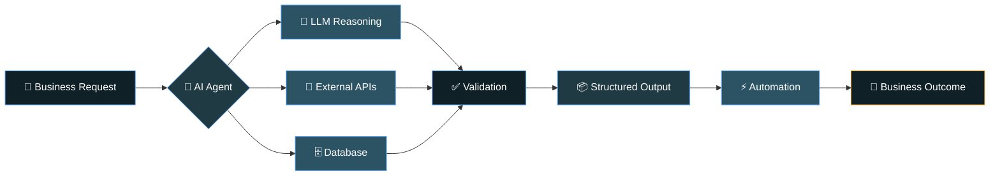

<div align="center">


<a href="https://github.com/KhaledEldfry">
  
</a>

<br/>

<a href="https://www.linkedin.com/in/khaled-ahmed-39075924/"></a>
<a href="mailto:khaledeldfry13@gmail.com"></a>
<a href="https://github.com/KhaledEldfry"></a>


</div>

<br/>

## 🧠 About Me

<table>
<tr>
<td>

```
Name: Khaled Ahmed
Role: AI Engineer
Location: Cairo, Egypt 🇪🇬

- Building multi-agent WhatsApp AI systems
  for businesses across Kuwait & the Gulf
- Working daily with Dify, LangChain, LangGraph
- Designing AI automation workflows connecting
  LLMs, APIs, databases and webhooks
- Background in Computer Vision & Deep Learning
- Interested in Generative AI, NLP, RAG
  and Intelligent Automation
- Arabic 🇪🇬 | English 🇬🇧
```

</td>
<td width="380">

</td>
</tr>
</table>

---

## ⚡ What I Build



---

## 🛠️ Tech Stack

<div align="center">

### 🤖 AI & LLM

<br/>


### 👁️ Machine Learning & Computer Vision

<br/>


### ⚙️ Backend & Automation

<br/>


### 🗄️ Data & Tools

<br/>


</div>

---

## 🚀 Featured Projects

<table>
<tr>
<td width="50%">

### 🦷 X-Dent — AI Dental Analysis
**YOLOv11 Instance Segmentation + AI-powered dental analysis**
Detects & segments individual teeth from dental X-rays.

`Python` `YOLOv11` `Computer Vision` `FastAPI`

[](https://github.com/KhaledEldfry/Tooth-instance-segmentation-Computer-Vision-Project)

</td>
<td width="50%">

### 🧠 Medical Regulatory Chatbot
An NLP/LLM chatbot for medical regulatory information with intelligent, context-aware responses.

`Python` `NLP` `LLMs` `Transformers`

[](https://github.com/KhaledEldfry/medical_reg_chatbot)

</td>
</tr>
<tr>
<td width="50%">

### 🚗 Arabic License Plate OCR
Computer vision pipeline for detecting and recognizing Arabic license plates in real time.

`Python` `OpenCV` `OCR` `Computer Vision`

[](https://github.com/KhaledEldfry/arabic_plate_OCR-)

</td>
<td width="50%">

### 💳 Fraud Detection
Machine learning model that flags fraudulent transactions using classification techniques.

`Python` `Scikit-learn` `Pandas` `ML`

[](https://github.com/KhaledEldfry/fraud-detection)

</td>
</tr>
</table>

---

## 📊 GitHub Stats

<div align="center">


</div>

<div align="center">

</div>

<div align="center">

</div>

---

## 🐍 Contribution Journey

<div align="center">

</div>

## 📈 Contribution Activity

<div align="center">

</div>

---

<div align="center">

### 📫 Let's Connect

<a href="https://www.linkedin.com/in/khaled-ahmed-39075924/"></a>
<a href="mailto:khaledeldfry13@gmail.com"></a>

*Building intelligent systems, one workflow at a time.* 🤖⚡


</div>
