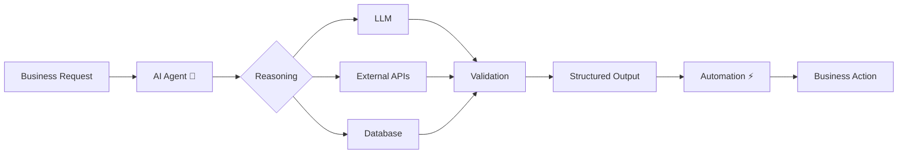

# 👋 Hi, I'm Khaled Ahmed

<p align="center">
  
</p>

<p align="center">
  <a href="https://www.linkedin.com/in/khaled-ahmed-39075924/">
    
  </a>
  <a href="mailto:khaledeldfry13@gmail.com">
    
  </a>
  <a href="https://github.com/KhaledEldfry">
    
  </a>
</p>

---

## 🧠 About Me

I'm an **AI Engineer** focused on building practical AI systems, intelligent automation workflows, and LLM-powered applications.

* 🤖 Building **AI Agents & LLM Applications**
* 🔗 Working with **LangChain & LangGraph**
* ⚙️ Designing **AI Automation & Workflow Systems**
* 🧩 Integrating LLMs with **APIs, databases, webhooks, and external services**
* 👁️ Experience in **Computer Vision & Deep Learning**
* 🧠 Interested in **Generative AI, NLP, AI Agents & Intelligent Automation**
* 🇪🇬 Based in **Cairo, Egypt**

---

## ⚡ What I Build

```text
Business Problem
       │
       ▼
┌──────────────────┐
│   AI Agent 🤖    │
└────────┬─────────┘
         │
 ┌───────┼────────┐
 ▼       ▼        ▼
LLMs    APIs    Databases
 │       │        │
 └───────┼────────┘
         ▼
   Decision / Action
         │
         ▼
   Automated Workflow
         │
         ▼
   Business Outcome 🚀
```

### 🔄 AI Workflow Architecture



---

## 🛠️ Tech Stack

### 🤖 AI & LLM

<p>
  
</p>

`LangChain` `LangGraph` `LLMs` `Generative AI` `AI Agents` `Prompt Engineering` `NLP` `Transformers`

### 👁️ Machine Learning & Computer Vision

<p>
  
</p>

`YOLO` `CNNs` `Transfer Learning` `Computer Vision` `Deep Learning`

### ⚙️ Backend & Automation

<p>
  
</p>

`REST APIs` `Webhooks` `Workflow Automation` `API Integration`

### 🗄️ Data & Tools

<p>
  
</p>

`Pandas` `NumPy` `SQL` `Data Processing`

---

## 🚀 Featured Projects

### 🦷 X-Dent — AI Dental Analysis

**YOLOv11 Instance Segmentation + AI-powered dental analysis**

A computer vision system designed to detect and segment individual teeth from dental X-ray images to support dental analysis.

**Tech:** `Python` `YOLOv11` `Computer Vision` `Instance Segmentation` `FastAPI`

<a href="https://github.com/KhaledEldfry/Tooth-instance-segmentation-Computer-Vision-Project">
  
</a>

---

### 🧠 Medical Regulatory Chatbot

An NLP/LLM-based chatbot designed to interact with medical regulatory information and provide intelligent responses.

**Tech:** `Python` `NLP` `LLMs` `Transformers`

<a href="https://github.com/KhaledEldfry/medical_reg_chatbot">
  
</a>

---

### 🚗 Arabic License Plate OCR

Computer vision pipeline for detecting and recognizing Arabic license plates.

**Tech:** `Python` `OpenCV` `OCR` `Computer Vision`

<a href="https://github.com/KhaledEldfry/arabic_plate_OCR-">
  
</a>

---

### 💳 Fraud Detection

Machine learning project focused on detecting fraudulent transactions using classification techniques.

**Tech:** `Python` `Scikit-learn` `Pandas` `Machine Learning`

<a href="https://github.com/KhaledEldfry/fraud-detection">
  
</a>

---

## 💼 Professional Focus

```text
AI Engineering
      │
      ├── LLM Applications
      │      ├── AI Agents
      │      ├── Prompt Engineering
      │      └── Structured Outputs
      │
      ├── AI Automation
      │      ├── Workflow Orchestration
      │      ├── API Integrations
      │      └── Business Process Automation
      │
      └── Machine Learning
             ├── Computer Vision
             ├── NLP
             └── Deep Learning
```

---

## 📊 GitHub Statistics

<p align="center">
  
  
</p>

<p align="center">
  
</p>

---

## 🐍 My Contribution Journey

<p align="center">
  
</p>

---

## 📈 Contribution Activity

<p align="center">
  
</p>

---

## 📫 Let's Connect

<p align="center">
  <a href="https://www.linkedin.com/in/khaled-ahmed-39075924/">
    
  </a>
  <a href="mailto:khaledeldfry13@gmail.com">
    
  </a>
</p>

<p align="center">
  <i>Building intelligent systems, one workflow at a time. 🤖</i>
</p>

---

<p align="center">
  
</p>
